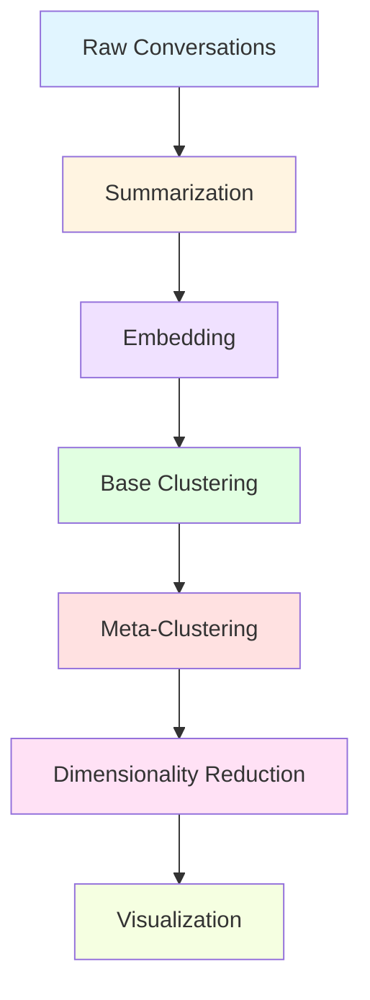

## What is Kura?

Kura is a conversation analysis system built on the same principles as Anthropic's CLIO framework. It transforms raw conversations into organized, searchable clusters that reveal patterns in how users interact with AI systems.

## The Pipeline Flow

Kura processes conversations through a multi-stage pipeline:



### Stage 1: Conversation Loading

Conversations are loaded from various sources (HuggingFace datasets, Claude exports, or custom formats). Each conversation contains:

- **chat_id**: Unique identifier
- **messages**: List of user/assistant exchanges
- **created_at**: Timestamp
- **metadata**: Optional custom properties

See [Conversations](/core-concepts/conversations) for details.

### Stage 2: Summarization

Each conversation is analyzed by an LLM to extract:
- Summary (1-2 sentences)
- User request and task description
- Languages used (human and programming)
- Concerning score (1-5 safety rating)
- User frustration level (1-5)
- Assistant errors

See [Summarization](/core-concepts/summarization) for details.

### Stage 3: Embedding

Summaries are converted to high-dimensional vectors (embeddings) that capture semantic meaning. This enables mathematical comparison of conversation similarity.

Supported embedding models:
- OpenAI (`text-embedding-3-small`)
- Sentence Transformers (local models)
- Cohere (`embed-v4.0`)

See [Embedding](/core-concepts/embedding) for details.

### Stage 4: Base Clustering

Embeddings are grouped using clustering algorithms:
- **K-means**: Partition conversations into N clusters
- **HDBSCAN**: Density-based clustering (finds natural groupings)

An LLM then generates descriptive names for each cluster by analyzing:
- Positive examples (conversations in the cluster)
- Contrastive examples (conversations from other clusters)

See [Clustering](/core-concepts/clustering) for details.

### Stage 5: Meta-Clustering

Base clusters are recursively combined into a hierarchy:

1. Generate candidate parent cluster names
2. Assign each cluster to a parent
3. Generate descriptions for parent clusters
4. Repeat until reaching the target number of root clusters

This creates a tree structure where specific clusters (e.g., "Debug Python pandas DataFrames") roll up into broader categories (e.g., "Programming assistance").

See [Meta-Clustering](/core-concepts/meta-clustering) for details.

### Stage 6: Dimensionality Reduction

Clusters are projected from high-dimensional embedding space to 2D coordinates using UMAP (Uniform Manifold Approximation and Projection). This enables visualization while preserving the relationships between clusters.

See [Dimensionality Reduction](/core-concepts/dimensionality-reduction) for details.

## Modular Architecture

Kura is designed with modularity in mind. Each stage uses abstract base classes:

- `BaseSummaryModel` - Implement custom summarization logic
- `BaseEmbeddingModel` - Integrate any embedding provider
- `BaseClusteringMethod` - Plug in different clustering algorithms
- `BaseMetaClusterModel` - Customize hierarchical organization
- `BaseDimensionalityReduction` - Use alternative projection methods

<Note>
All components are swappable through dependency injection, allowing you to customize any part of the pipeline without modifying core code.
</Note>

## Checkpointing for Scale

Kura automatically saves intermediate results at each pipeline stage. This provides:

- **Resume capability**: Re-run analysis without repeating expensive steps
- **Iterative refinement**: Adjust later stages without re-processing earlier ones
- **Multiple formats**: JSONL, Parquet, HuggingFace Datasets, SQL

See [Checkpoints](/core-concepts/checkpoints) for details.

## Two API Approaches

Kura offers two ways to use the pipeline:

### Functional API (Recommended)

Compose pipeline stages as pure functions:

```python
from kura.summarisation import summarise_conversations, SummaryModel
from kura.cluster import generate_base_clusters_from_conversation_summaries
from kura.meta_cluster import reduce_clusters_from_base_clusters
from kura.dimensionality import reduce_dimensionality_from_clusters

# Each function is independent and composable
summaries = await summarise_conversations(
    conversations=conversations,
    model=SummaryModel()
)

clusters = await generate_base_clusters_from_conversation_summaries(
    summaries=summaries
)

meta_clusters = await reduce_clusters_from_base_clusters(
    clusters=clusters,
    model=MetaClusterModel(max_clusters=10)
)

projected = await reduce_dimensionality_from_clusters(
    clusters=meta_clusters,
    model=HDBUMAP()
)
```

### Class-Based API

Orchestrate through a single `Kura` class (legacy approach).

## Next Steps

<CardGroup cols={2}>
  <Card title="Conversations" icon="message" href="/core-concepts/conversations">
    Learn about the conversation data model and loading methods
  </Card>
  <Card title="Summarization" icon="sparkles" href="/core-concepts/summarization">
    Understand how conversations are analyzed by LLMs
  </Card>
  <Card title="Embedding" icon="vector-square" href="/core-concepts/embedding">
    Convert text to semantic vectors
  </Card>
  <Card title="Clustering" icon="object-group" href="/core-concepts/clustering">
    Group similar conversations together
  </Card>
</CardGroup>
