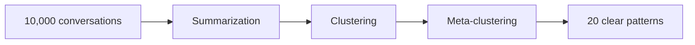

## Transform chat data into actionable insights

Your AI assistant handles thousands of conversations daily. Kura helps you understand what users actually need by automatically clustering conversations into meaningful patterns.

<Note>
Kura is inspired by [Anthropic's CLIO research](https://www.anthropic.com/research/clio) and designed to work at scale—from 100 conversations to millions.
</Note>

## Why Kura?

Manually reviewing conversations doesn't scale. Traditional analytics miss semantic meaning. Kura bridges this gap by using machine learning to group similar conversations, revealing:

- **Pain points** affecting your users
- **Feature requests** hidden in unstructured data
- **Failure patterns** before users complain
- **Success signals** to amplify

### Real-world impact

<CardGroup cols={2}>
  <Card title="E-commerce support bot" icon="cart-shopping">
    Analyzed 50,000 weekly conversations. Discovered 35% of shipping queries clustered into 3 fixable issues. Reduced support volume by 40%.
  </Card>
  
  <Card title="Developer docs assistant" icon="code">
    Found 2,000+ conversations about 5 consistently confusing APIs. Targeted improvements reduced those queries by 60%.
  </Card>
  
  <Card title="SaaS onboarding bot" icon="rocket">
    Revealed 3 missing integration requests from clustering. Built them, increased trial conversion by 18%.
  </Card>
  
  <Card title="Product analytics" icon="chart-line">
    Identified feature requests repeated by hundreds of users in different ways. Informed roadmap prioritization.
  </Card>
</CardGroup>

## How it works

Kura processes your conversation data through a multi-stage pipeline:



<Steps>
  <Step title="Summarize conversations">
    Each conversation is condensed into a concise task description using LLMs, with optional disk caching for efficiency.
  </Step>
  
  <Step title="Generate embeddings">
    Summaries are converted into vector representations that capture semantic meaning.
  </Step>
  
  <Step title="Cluster by similarity">
    Similar conversations are grouped together using K-means or other clustering algorithms.
  </Step>
  
  <Step title="Build hierarchy">
    Clusters are organized into a hierarchical structure for easy navigation and analysis.
  </Step>
</Steps>

## Key features

<CardGroup cols={3}>
  <Card title="Automatic intent discovery" icon="magnifying-glass">
    Find what users actually want, not just what they say
  </Card>
  
  <Card title="Semantic clustering" icon="diagram-project">
    Group by meaning, not keywords
  </Card>
  
  <Card title="Privacy-first design" icon="shield-halved">
    Analyze patterns without exposing individual conversations
  </Card>
  
  <Card title="Multiple data sources" icon="database">
    Load from HuggingFace datasets, Claude exports, or custom formats
  </Card>
  
  <Card title="Flexible checkpoints" icon="floppy-disk">
    Save progress in JSONL, Parquet, or HuggingFace dataset formats
  </Card>
  
  <Card title="Rich visualization" icon="tree">
    Explore clusters in terminal or web UI
  </Card>
</CardGroup>

## When to use Kura

<Tip>
Kura excels when you have 100+ conversations and need to understand patterns rather than individual interactions.
</Tip>

**Perfect for:**
- Product teams discovering feature requests
- Customer success teams identifying support deflection opportunities
- AI/ML teams evaluating model performance beyond metrics
- Analytics teams understanding user segments by behavior

**Not ideal for:**
- Real-time analysis (Kura is designed for batch processing)
- Fewer than 100 conversations (manual review may be faster)
- Simple keyword search (use traditional search tools)
- Individual conversation sentiment analysis (Kura focuses on patterns)

## Get started

<CardGroup cols={2}>
  <Card title="Installation" icon="download" href="/installation">
    Install Kura with pip, uv, or conda
  </Card>
  
  <Card title="Quickstart tutorial" icon="bolt" href="/quickstart">
    Process your first conversations in 5 minutes
  </Card>
  
  <Card title="Core concepts" icon="book" href="/core-concepts/overview">
    Learn about the analysis pipeline
  </Card>
  
  <Card title="API reference" icon="code" href="/api/summarisation">
    Explore the complete API documentation
  </Card>
</CardGroup>

## From zero to insights in 5 minutes

Here's a complete example that loads conversations, processes them, and visualizes the results:

```python
import asyncio
from kura.types import Conversation
from kura.summarisation import SummaryModel, summarise_conversations
from kura.cluster import ClusterDescriptionModel, generate_base_clusters_from_conversation_summaries
from kura.meta_cluster import MetaClusterModel, reduce_clusters_from_base_clusters
from kura.dimensionality import HDBUMAP, reduce_dimensionality_from_clusters
from kura.visualization import visualise_pipeline_results
from kura.checkpoints import JSONLCheckpointManager
from rich.console import Console

async def main():
    # Load conversations from HuggingFace
    conversations = Conversation.from_hf_dataset(
        "ivanleomk/synthetic-gemini-conversations",
        split="train"
    )
    
    # Configure pipeline
    console = Console()
    checkpoint_manager = JSONLCheckpointManager("./checkpoints", enabled=True)
    
    # Process conversations
    summaries = await summarise_conversations(
        conversations,
        model=SummaryModel(console=console),
        checkpoint_manager=checkpoint_manager
    )
    
    clusters = await generate_base_clusters_from_conversation_summaries(
        summaries,
        model=ClusterDescriptionModel(console=console),
        checkpoint_manager=checkpoint_manager
    )
    
    reduced_clusters = await reduce_clusters_from_base_clusters(
        clusters,
        model=MetaClusterModel(console=console),
        checkpoint_manager=checkpoint_manager
    )
    
    projected_clusters = await reduce_dimensionality_from_clusters(
        reduced_clusters,
        model=HDBUMAP(),
        checkpoint_manager=checkpoint_manager
    )
    
    # Visualize results
    visualise_pipeline_results(projected_clusters, style="rich")

if __name__ == "__main__":
    asyncio.run(main())
```

<Tip>
The example above includes checkpoint management, so if the process is interrupted, you can resume from where you left off.
</Tip>

## Community and support

Kura is under active development by [567 Labs](https://github.com/567-labs).

- **GitHub**: [567-labs/kura](https://github.com/567-labs/kura)
- **Issues**: [Report bugs or request features](https://github.com/567-labs/kura/issues)
- **License**: MIT

<Warning>
Kura is in active development. APIs may change between versions. Check the [release notes](https://github.com/567-labs/kura/releases) for breaking changes.
</Warning>